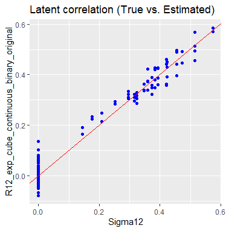
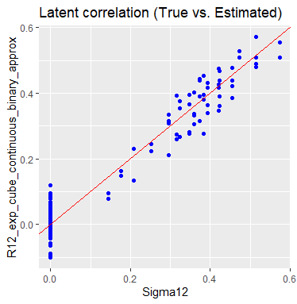

```{r setup, include=FALSE}
knitr::opts_chunk$set(echo = FALSE)
```

## Background

- Mixed data types (Continuous, binary, truncated, ordinal) are very common in both natural science (e.g. gene representation) and social science (e.g. rating, policy dummy, reporting threshold) research topics.

{#id .class width=300 height=200px}

{#id .class width=300 height=200px}

## Background

{#id .class width=600 height=400px}

- Mixed data types (e.g. character, numerical, integer, unsigned integer) in computer language are easy to be matched to data types in math.

## Background

- Traditionally, econometricians deal with mixed data types case-by-case via specific model assumptions (e.g. Logit/Probit Model, Discrete Choice Model).

Multi-class logistic regression: $n$ samples $(x_i, y_i)$, $x_i\in \mathbb{R}^p$, $y_i\in \{0, \dots, K-1\}$. For each class $k\in\{0, \dots, K-1\}$, we consider class probabilities for sample $i$ conditioning on the corresponding vector of covariates $x_i$:
$$
p_k(x_i) = P(y_i = k|x_i), \quad \sum_{k=0}^{K-1}p_k(x_i) = 1.
$$
$$
p_k(x_i) = \frac{e^{x_i^{\top}\beta_k}}{\sum_{l=0}^{K-1}e^{x_i^{\top}\beta_l}}.
$$


## Introduction

- It's difficult to embed these models into other methods (e.g. K-means, K-nn, Principle Component Analysis, Canonical Component Analysis).
- To build the infrastructure for further analysis, we need a general method (computing package) to estimate latent correlation (correlation matrix) in mixed data, especially for rank-based estimators. 
- Fan et.al (2017) captures the binary measurements. Quan et.al (2018) extends it to ordinal variables. Yoon, Carroll and Gaynanova (2020, 2019) extends it to truncated cases and develops mixed data Canonical Component Analysis (https://github.com/irinagain/mixedCCA). These models are very flexible and capture all dependencies via common latent correlation matrix based on a robust rank-based measure of association (Kendall's $\tau$).


## Introduction

- Yoon, Muller and Gaynanova (2020) provides fast computation of latent correlation via multi-linear interpolation.
- Huang and Gaynanova are extending it to truncated/ordinal cases and developing a comprehensive R-package (will go public in a few days https://github.com/mingzehuang/latentcor).


## Latent Gaussian Copula Model

- As long as some latent variable can be viewed as some monotonic transformation of Gaussian distribution, we would consider to apply Gaussian Copula Model.

- Definition 1 (Gaussian Copula Model). A random vector$X=(X_1, ..., X_p)^T$ satisfies a Gaussian copula model if there exists a set of monotonically increasing transformations $f=(f_{j})_{j=1}^p$ such that $f(X)=\{f_1(X_1), ..., f_p(X_p)\}^T\sim N_p(0, \Sigma)$ with $\Sigma_{jj}=1$ for all $j$. We denote this by $X\sim NPN(0, \Sigma, f)$.

## Latent Gaussian Copula Model

- Definition 2 (Latent Gaussian Copula Model for Mixed Data). Let $X_1\in\cal{R}^{p_1}$ be continuous, $X_2\in\cal{R}^{p_2}$ be binary random vectors and $X=(X_1, X_2)$. Then $X$ satisfies the latent Gaussian copula model if there exists a $p_2$ dimensional random vector $U_2=(U_{p_1+1}, ..., U_{p_1+p_2})^T$ such that $U:=(X_1, U_2)\sim NPN(0,\Sigma,f)$ and $X_j=I(U_j>C_j)$ for all $j=p_1+1, ..., p_1+p_2$, where $I(\cdot)$ is the indicator function and $C=(C_1, ..., C_{p_2})$ is a vector of constants. We denote this by $X\sim LNPN(0,\Sigma,f,C)$ where $\Sigma$ is the latent correlation matrix.

## Latent Gaussian Copula Model

- Latent correlation matrix $\Sigma$ can be estimated via bridge function $F$ such that $E(\hat{\tau}_{jk})=F(\sigma_{jk})$, where $\sigma_{jk}$ is latent correlation between variable $j$ and $k$, and $\hat{\tau}_{jk}=\hat{\tau}(x_j, x_k)$
$$=\frac{2}{n(n-1)}\sum_{1\leq i\leq i'\leq n} sign(x_{ij}-x_{i'j})sign(x_{ik}-x_{i'k})$$ 
- In other words, Kendall $\tau$ captures concordant pairs vs discordant pairs in two variables.
- By solving bridge function $F$ inversely, we can get latent correlation $\sigma_{jk}$ from $\hat{\tau}_{jk}$.
- Detail derivation in related papers.

## Simulation

n <- 1000; p1 <- 15; p2 <- 10;
copula1 <- "exp"; copula2 <- "cube";
type1 <- "continuous"; type2 <- "binary"

{#id .class width=350 height=400px}
{#id .class width=350 height=400px}


## Simulation

n <- 1000; p1 <- 15; p2 <- 10;
copula1 <- "exp"; copula2 <- "cube";
type1 <- "continuous"; type2 <- "trunc"

{#id .class width=350 height=400px}

{#id .class width=350 height=400px}

## Simulation

n <- 1000; p1 <- 15; p2 <- 10;
copula1 <- "exp"; copula2 <- "cube";
type1 <- "binary"; type2 <- "truncated"

{#id .class width=350 height=400px}
{#id .class width=350 height=400px}

## Multilinear interpolation

- Definition 3 (Bilinear interpolation). Suppose we have 4 neighboring data points $f_{ij}=f(x_i, y_j)$ at $(x_i, y_j)$ for $i, j\in\{0, 1\}$. For $\{(x, y)|x_0\leq x\leq x_1, y_0\leq y\leq y_1\}$, the bilinear interpolation at $(x, y)$ is $\tilde{f}(x, y)=(1-\alpha)(1-\beta)f_{00}+(1-\alpha)\beta f_{01}+\alpha\beta f_{11}$
where $\alpha=(x-x_0)/(x_1-x_0)$ and $\beta=(y-y_0)/(y_1-y_0)$.

- Using multi-linear interpolation as approximation, our algorithm goes 10 times faster than original estimation. Detail timing results see Yoon, Muller and Gaynanova (2020), Huang and Gaynanova's package vignette (https://github.com/mingzehuang/latentcor).

## Application

- Yoon, Carroll and Gaynanova (2020) has embed it into sparse canonical correlation analysis on microRNA data.
- I plan to estimate latent correlation for mixed data PCA and CCA to summarize government responses over Covid-19 infection related variables, which we can build upon Hallas et.al's COVID-19 GOVERNMENT RESPONSE TRACKER (https://www.bsg.ox.ac.uk/research/research-projects/covid-19-government-response-tracker) and its dataset (https://github.com/OxCGRT/USA-covid-policy).
- Government responses (e.g. school closing, workplace closing, cancel public events, et.al) are ordinal data (See https://github.com/OxCGRT/covid-policy-tracker/blob/master/documentation/codebook.md).

## Application
- State-by-state covid cases and death (https://www.nytimes.com/interactive/2020/us/coronavirus-us-cases.html) are continuous/truncated data (https://github.com/nytimes/covid-19-data).
- 
